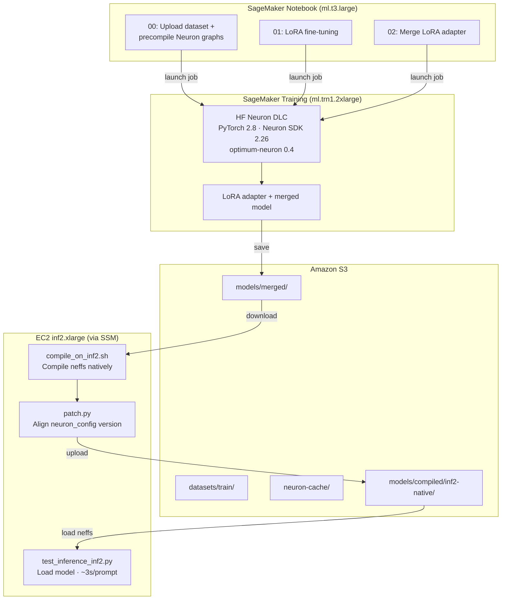

# Lab 8 — Fine-Tune & Deploy on AWS Trainium and Inferentia2

Fine-tune an LLM with LoRA on **AWS Trainium** and run inference on **AWS
Inferentia2** — using Amazon SageMaker for training orchestration and a
standalone inf2 EC2 instance for compilation and inference testing.

## What You'll Learn

- How to use **AWS Trainium** (`ml.trn1.2xlarge`) for cost-efficient LLM fine-tuning
- How to apply **LoRA** (Low-Rank Adaptation) to train only ~0.5% of model parameters
- How to **merge** a LoRA adapter back into the base model
- How to **compile** a model natively on **Inferentia2** for optimized inference
- How the **Neuron SDK** and **Optimum Neuron** enable standard HuggingFace workflows on AWS custom silicon

## Workshop Flow

| Step | Notebook / Script | What | Instance | Time |
|------|-------------------|------|----------|------|
| 0 | `00_workshop_prep.ipynb` | Upload dataset, precompile Neuron graphs | ml.trn1.2xlarge (SageMaker) | ~50 min (one-time) |
| 1 | `01_fine-tuning.ipynb` | LoRA fine-tuning with cached neffs | ml.trn1.2xlarge (SageMaker) | ~5 min |
| 2 | `02_deploy_prep.ipynb` | Merge LoRA adapter into base model | ml.trn1.2xlarge (SageMaker) | ~5 min |
| 3 | `scripts/inf2/compile_on_inf2.sh` | Compile merged model for Inferentia2 | inf2.xlarge (EC2) | ~15 min |
| 4 | `scripts/inf2/test_inference_inf2.py` | Run inference on compiled model | inf2.xlarge (EC2) | instant |

**Total lab time:** ~25 min (steps 1-4, assuming step 0 was run ahead of time)

## Model

Configured in [`config.py`](./config.py) — currently set to
**[Qwen3-0.6B](https://huggingface.co/Qwen/Qwen3-0.6B)** (0.6B parameters).

| Option | Params | Training Time | Output Quality |
|--------|--------|---------------|----------------|
| `Qwen/Qwen3-1.7B` | 1.7B | ~15-20 min | Better |
| `Qwen/Qwen3-0.6B` (current) | 0.6B | ~5 min | Lower |

Both are Apache 2.0 licensed, no gating, no HuggingFace login required.

## Prerequisites

- SageMaker Studio notebook with Python 3 kernel (`ml.t3.large`)
- Service quotas for `ml.trn1.2xlarge` (training jobs)
- An `inf2.xlarge` EC2 instance for compilation and inference (see `scripts/infra/ec2-inf2-cfn.yaml`)
- SageMaker Distribution Image 4.2 or later

## Architecture



## File Structure

```
lab-8-trainium-inferentia/
├── 00_workshop_prep.ipynb      # One-time: dataset + Neuron graph precompile
├── 01_fine-tuning.ipynb        # LoRA fine-tuning on Trainium
├── 02_deploy_prep.ipynb        # Merge LoRA adapter into base model
├── config.py                   # Model selection + region config
├── requirements.txt            # Notebook-level dependencies
├── src/                        # Scripts that run INSIDE SageMaker training jobs
│   ├── train.py                # LoRA training logic (NeuronSFTTrainer)
│   ├── run_training.py         # Entry point: installs optimum-neuron 0.4.2, launches training
│   ├── precompile.py           # Neuron graph precompilation (00_workshop_prep)
│   ├── consolidate_and_merge.py # Merge LoRA adapter into base model
│   └── export_for_inference.py # Compile for inference (legacy SageMaker path)
├── scripts/
│   ├── infra/                  # CloudFormation templates
│   │   ├── ec2-inf2-cfn.yaml  # inf2.xlarge instance for compile + inference
│   │   └── ec2-trn1-cfn.yaml  # trn1.2xlarge instance (debug, can be deleted)
│   ├── inf2/                   # Compile + test on inf2 EC2 instance
│   │   ├── compile_on_inf2.sh  # Download merged model, compile, upload to S3
│   │   ├── test_inference_inf2.py # Load compiled model and run prompts
│   │   ├── patch.py            # Patch neuron_config.json version field
│   │   └── requirements-inf2.txt # Frozen Python deps for inf2 venv
│   ├── fine_tuning.py          # Standalone fine-tuning script (reference)
│   ├── workshop_prep.py        # Standalone prep script (reference)
│   └── prep_test_data.py       # Dataset preparation utility
├── datasets/                   # Pre-processed Dolly dataset (train + eval splits)
└── training_job_name.txt       # Auto-generated: bridges notebook 01 → 02
```

## Key Technologies

| Component | Version | Purpose |
|-----------|---------|---------|
| [Neuron SDK](https://aws.amazon.com/machine-learning/neuron/) | 2.26 | Compiler + runtime for Trainium/Inferentia |
| [Optimum Neuron](https://huggingface.co/docs/optimum-neuron) | 0.4.1 (DLC) / 0.4.2 (training) / 0.4.5 (inf2 venv) | HuggingFace integration for Neuron |
| [PEFT](https://huggingface.co/docs/peft) | latest | LoRA adapter for parameter-efficient fine-tuning |
| [SageMaker SDK](https://sagemaker.readthedocs.io/) | ≥3.13.1 | Training job orchestration |

## S3 Layout

All artifacts land in the default SageMaker bucket under this prefix:

```
s3://<bucket>/lab8-trainium-inferentia/
├── datasets/train/                    # Training data (Dolly 1000 samples)
├── neuron-cache/Qwen3-0.6B/          # Precompiled training neffs
├── output/<training-job>/output/      # LoRA adapter (model.tar.gz)
├── models/merged/<training-job>/      # Merged full model
└── models/compiled/<training-job>/
    └── inf2-native/model.tar.gz      # Compiled for Inferentia2
```

## Inference Results

Tested on `inf2.xlarge` (2 NeuronCores, 32GB HBM):

- Model load time: **8.4s** (from pre-compiled neffs, no lazy compilation)
- Device memory usage: **2.83 GB** of 32 GB
- Inference latency: **~3s per prompt** (256 max new tokens)
- The fine-tuned model generates coherent Dolly-style responses (closed QA, brainstorming, open QA)

## Known Issues / Lessons Learned

1. **Version mismatch**: The `neuron_config.json` `optimum_neuron_version` field must match the runtime version exactly. Use `scripts/inf2/patch.py` to align.
2. **Cross-compilation**: Neffs compiled on trn1 do NOT load on inf2 (different NRT versions/targets). Always compile on the target hardware.
3. **DLC inference handler bug**: The HuggingFace inference DLC (0.4.1) cannot load pre-compiled NxD models via its default pipeline handler. A custom `code/inference.py` is required but even that has issues. Direct EC2 inference is more reliable.
4. **MMS workers**: On inf2.xlarge with `tp_degree=2`, set `SAGEMAKER_MODEL_SERVER_WORKERS=1` — the model needs both NeuronCores.
