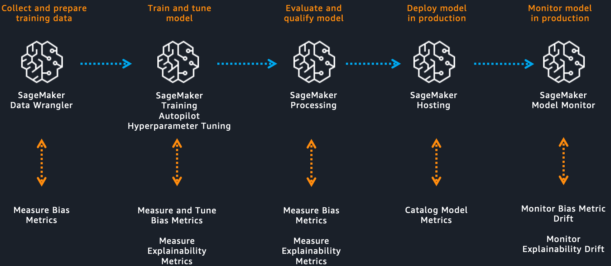
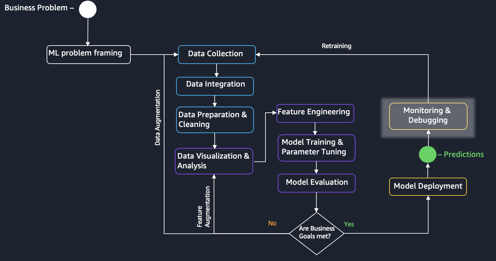

## Lab 5. Bias and Explainability
## Overview

[Amazon SageMaker Clarify](https://aws.amazon.com/sagemaker/clarify/) helps improve your machine learning models by detecting potential bias and helping explain how these models make predictions. The fairness and explainability functionality provided by SageMaker Clarify takes a step towards enabling AWS customers to build trustworthy and understandable machine learning models.

**Biases** are imbalances in the training data or prediction behavior of the model across different groups, such as age or income bracket. Biases can result from the data or algorithm used to train your model. For instance, if an ML model is trained primarily on data from middle-aged individuals, it may be less accurate when making predictions involving younger and older people. The field of machine learning provides an opportunity to address biases by detecting them and measuring them in your data and model. You can also look at the importance of model inputs to explain why models make the predictions they do.

Amazon SageMaker Clarify detects potential bias during data preparation, after model training, and in your deployed model by examining attributes you specify. For instance, you can check for bias related to age in your initial dataset or in your trained model and receive a detailed report that quantifies different types of possible bias. 

SageMaker Clarify also includes **feature importance** graphs that help you explain model predictions and produces reports which can be used to support internal presentations or to identify issues with your model that you can take steps to correct.

Amazon SageMaker Clarify works across the entire ML workflow to implement bias detection and explainability. 

 - It can look for bias in your initial dataset as part of SageMaker Data Wrangler
 - It can check for bias in your trained model as part of SageMaker Experiments, and also explain the behavior of your model overall
 - It extends SageMaker Model Monitor to check for changes in bias or explainability over time in your deployed model
 - It can provide explanations for individual inferences made by your deployed model

In this tutorial, you will learn highlighted section:

