## Credit risk prediction and explainability and bias detection with Amazon SageMaker

In this workshop, we demonstrate a end to end ML use case of credit risk prediction with model explainability and bias detection. We use a well known open source dataset https://archive.ics.uci.edu/ml/datasets/South+German+Credit+%28UPDATE%29 .
We show how to use SageMaker Clarify to run explainability and bias detection on a SageMaker inference pipeline model. We include the explainability and bias reports from Clarify as well as relevant links to further resources on this subject.

Below is the architecture diagram used in the solution:

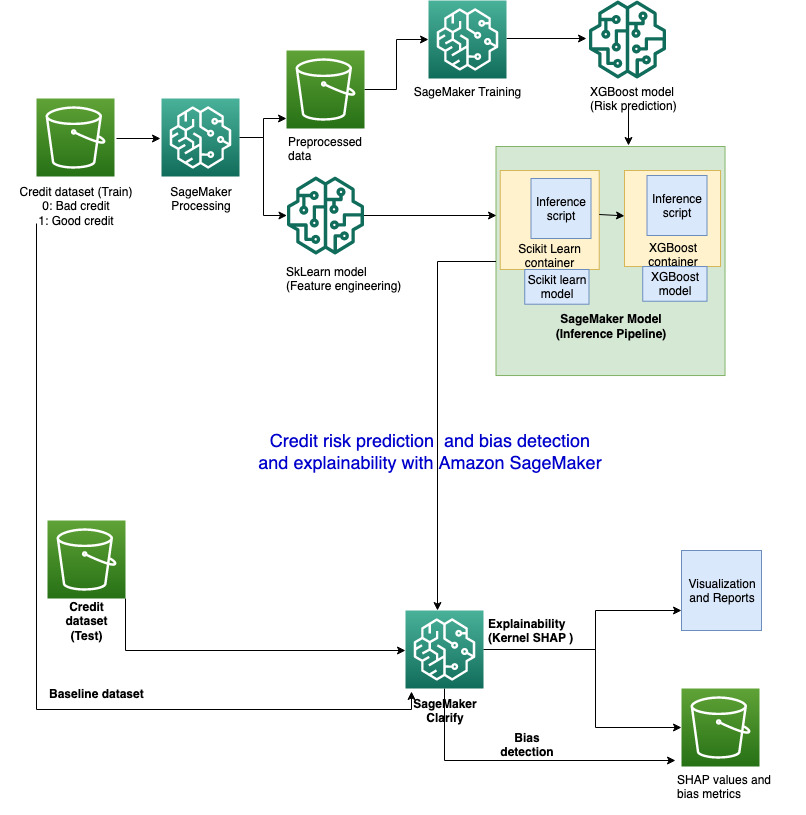

The notebook performs the following steps:

1. Prepare raw training and test data
2. Create a SageMaker Processing job which performs preprocessing on the raw training data and also produces an SKlearn model which is reused for deployment.
3. Train an XGBoost model on the processed data using SageMaker's built-in XGBoost container
4. Create a SageMaker Inference pipeline containing the SKlearn and XGBoost model in a series
5. Perform inference by supplying raw test data
6. Set up and run explainability job powered by SageMaker Clarify
7. Use open source shap library to create summary and waterfall plots to understand the feature importance better
8. Run bias analysis jobs
9. Clean up

## Lab Instructions
## Event Engine AWS Account access

Go to: https://dashboard.eventengine.run/login. You will be redirected to the page below.

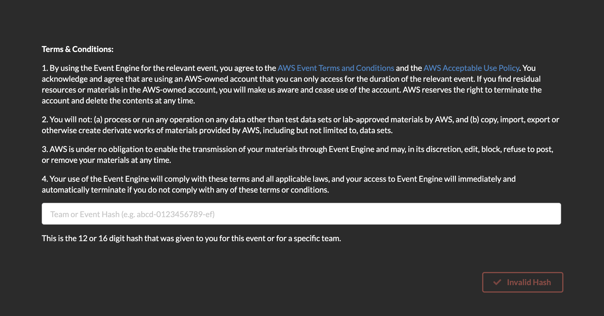

Enter the event hash you have received from your instructor.

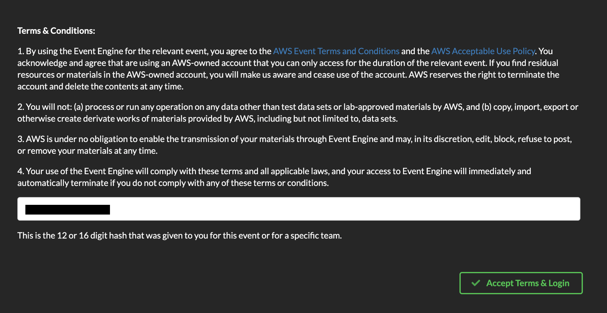

Click on Email One-Time Password (OTP).

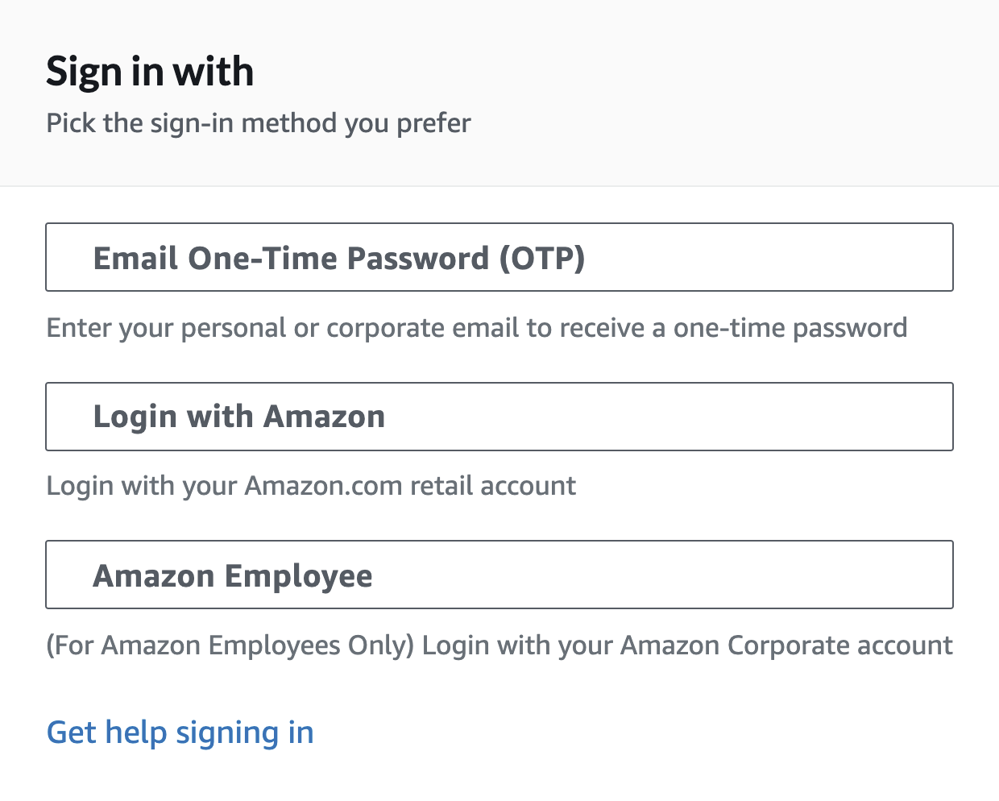

You are redirected to the following page:

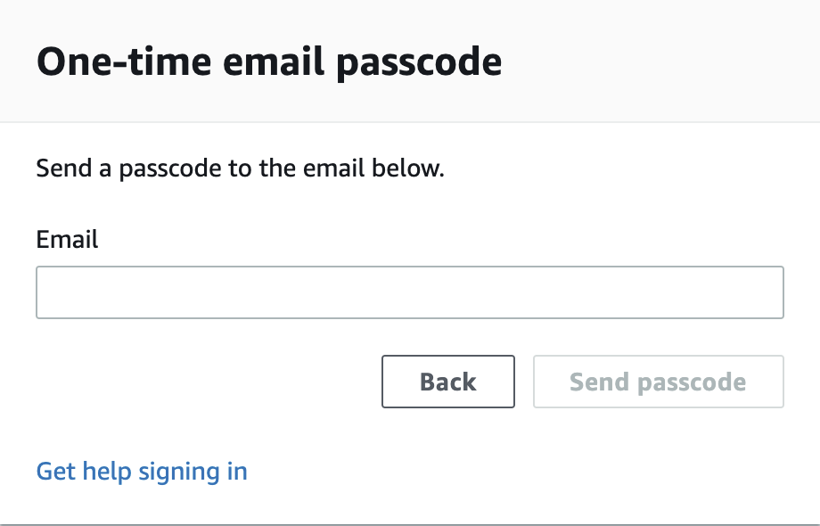

Enter your email address and click on Send passcode.

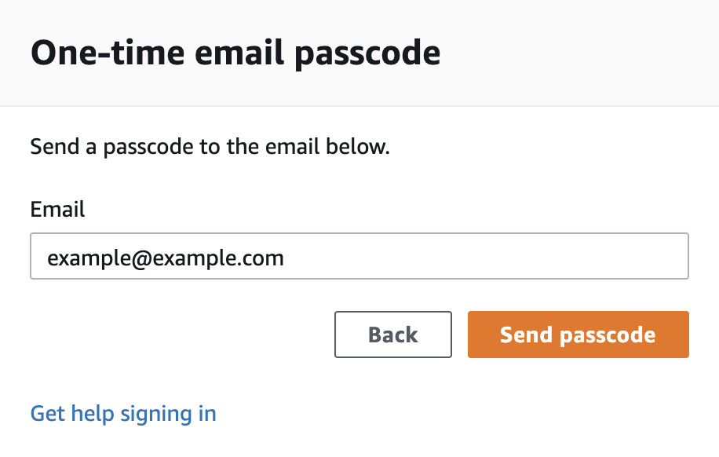

You are redirected to the following page:

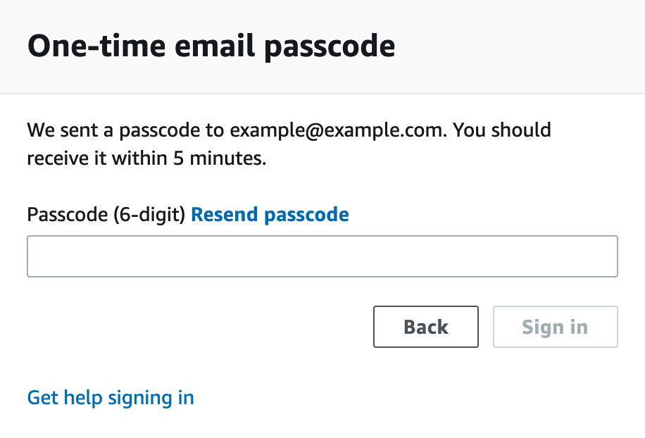

Check your mailbox, copy-paste the one-time password and click on Sign in.

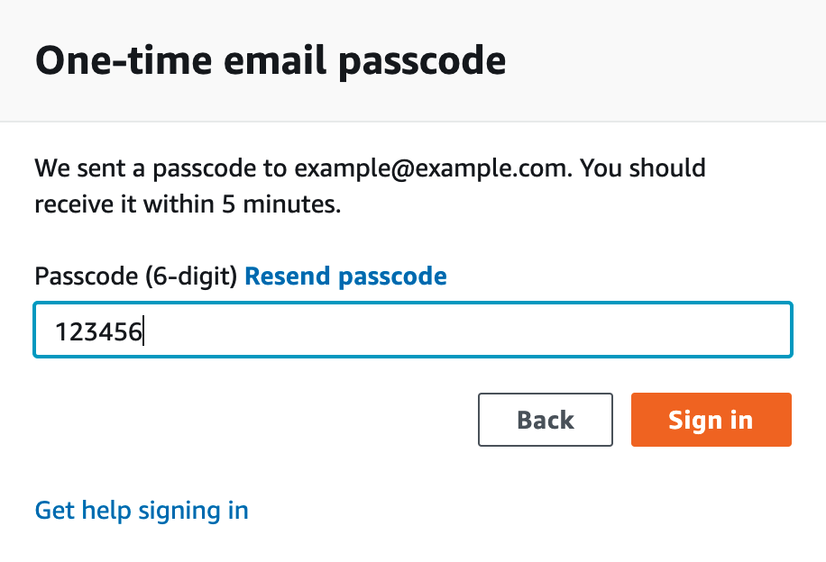

You are redirected to the Team Dashboard. Click on AWS Console.

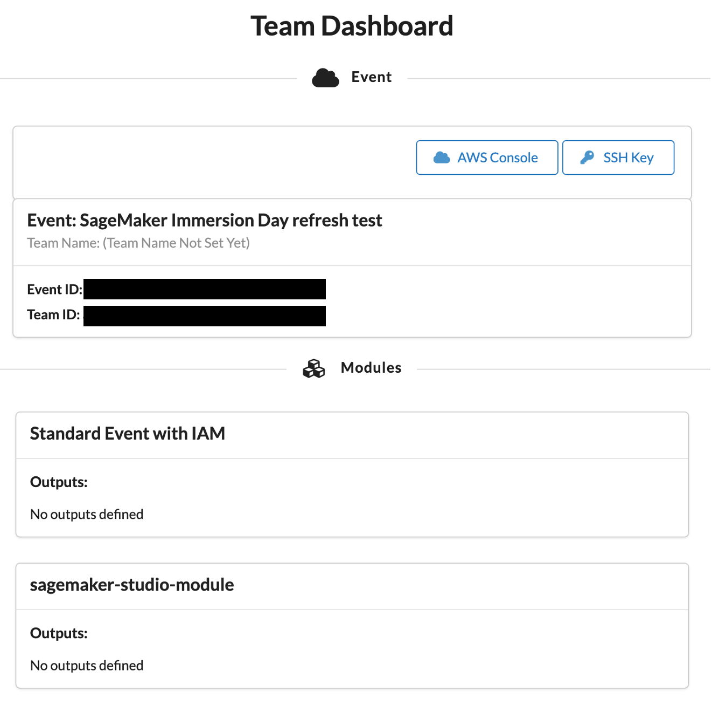

On the next screen, click on Open AWS Console.

You are then redirected to the AWS Console.

## Amazon SageMaker Studio access

Amazon SageMaker Studio is a web-based, integrated development environment (IDE) for machine learning that lets you build, train, debug, deploy, and monitor your machine learning models. Studio provides all the tools you need to take your models from experimentation to production while boosting your productivity.

If the AWS Account has been provisioned by your AWS Instructor, follow the next steps to access the SageMaker Studio environment:

1. Open AWS console and switch to AWS region communicated by your instructor.

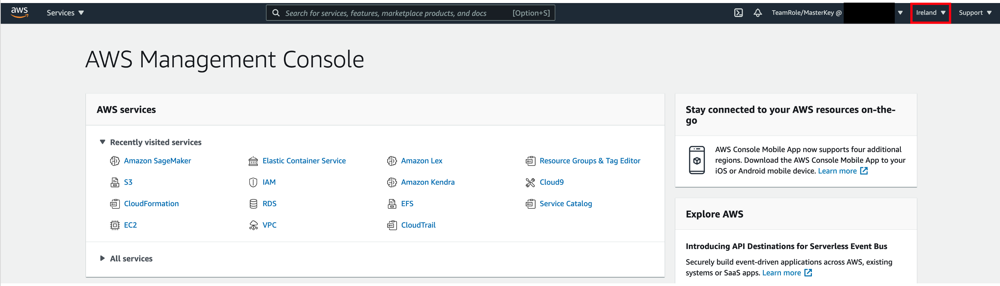

2. Under services search for Amazon SageMaker.

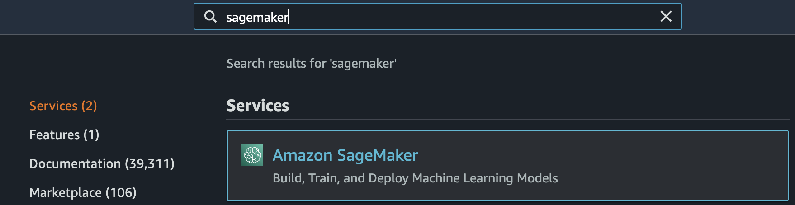

3. Under Get Started, click on the orange button SageMaker Studio.

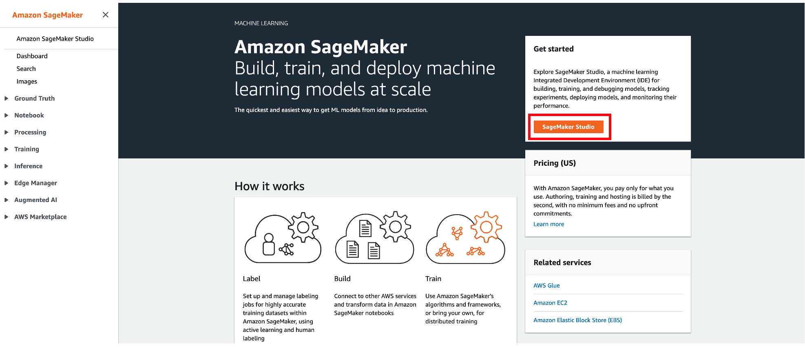

4. A SageMaker Studio environment should already be provisioned. Click on Open Studio (on the right side of the preprovisioned sagemakeruser username).

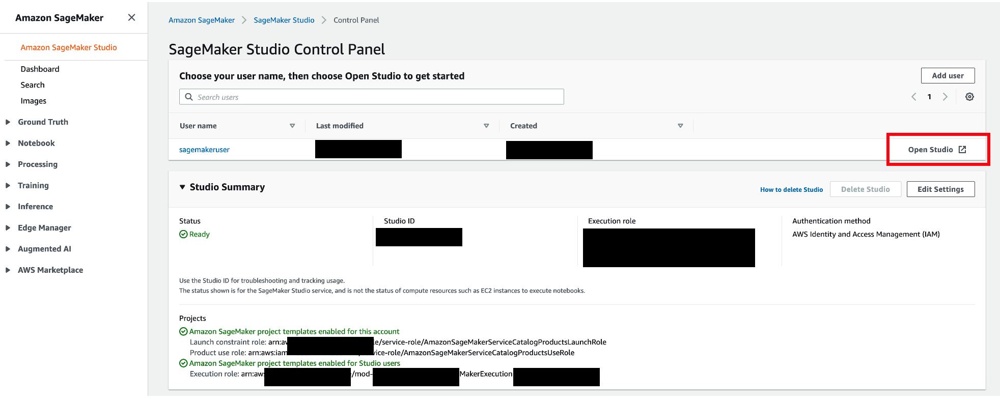

5. The page can take 1 or 2 minutes to load when you access SageMaker Studio for the first time.

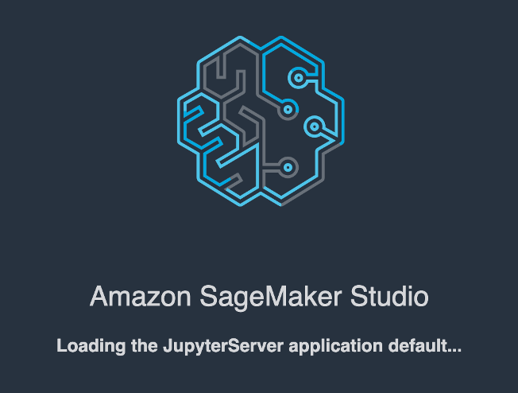

6. You will be redirected to a new web tab that looks like this:

7. Under Utilities and files click on System terminal

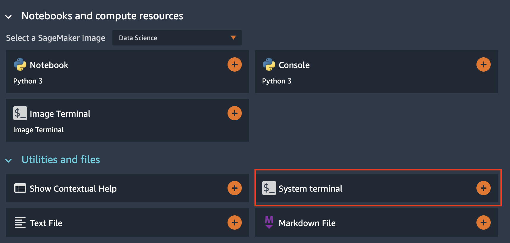

8. In the terminal, type the following command:

git clone https://github.com/aws-samples/amazon-sagemaker-credit-risk-prediction-explainability-bias-detection

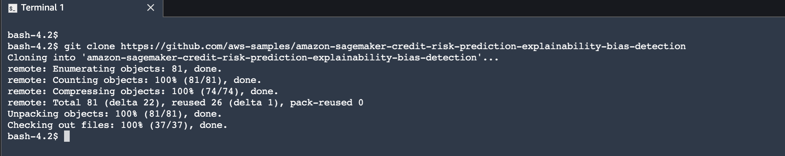

9. After completion of step 9 you will have amazon-sagemaker-credit-risk-prediction-explainability-bias-detection folder created in left panel of the studio:

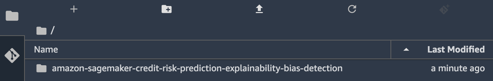

10. Under amazon-sagemaker-credit-risk-prediction-explainability-bias-detection double click on credit_risk_explainability_inference_pipelines_with_output.ipynb and Select Kernel as Python 3 (Data Science)

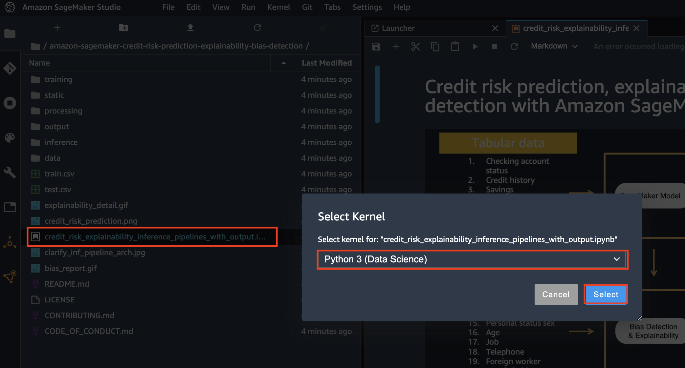

Congratulations!! You have successfully downloaded the content of the credit risk explainability lab, please follow the instructions in the jupyter notebook.
Please note that links to pdf reports and studio reports for explainability and bias are generated in the notebook.
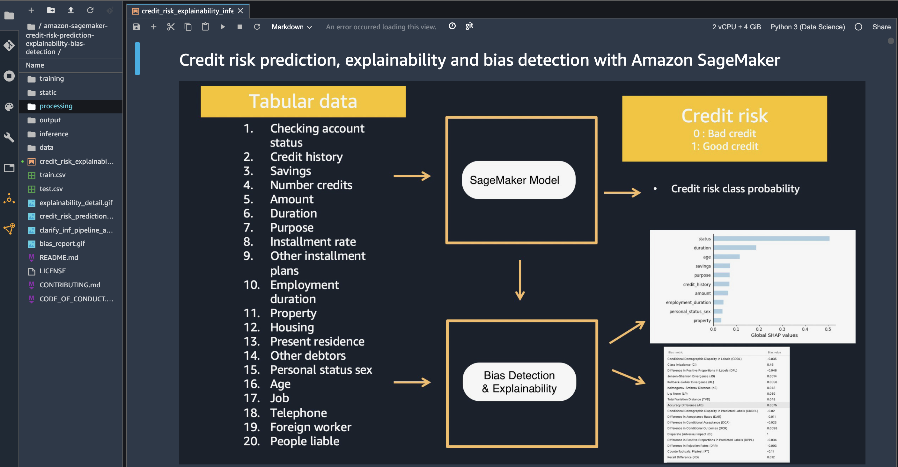

